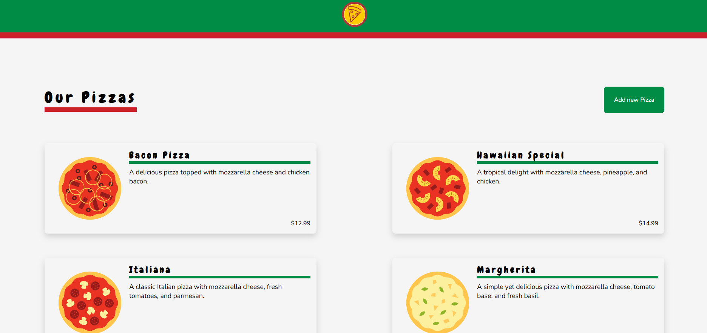

# 🍕 CodePizza



This is a simple application built with React and Vite, JSON server and custom CSS.

## 🍕 Features

Simplified application with default usage of forms handling, routing, fetching data using `fetch`. This is basic application demonstrating basic React features. For simplicity values are hardcoded in the components.

## 🍕 Technology

🚀 React </br>
🚀 TypeScript</br>
🚀 Vite</br>
🚀 CSS</br>
🚀 JSON server</br>
🚀 React Router</br>

## 🍕 Installation

1. Clone git repository:

2. Install dependencies:

```powershell
npm install
```

3. Run the app and the JSON server in separate terminals:

```powershell
npm run dev
npm run server
```

## 🍕 Overview

The main component `App.tsx` is rendering routes. `PizzasPage` component is fetching all Pizzas with `fetch` and assigning response data to `pizza` state. We also render the `PizzaCard` component for each pizza in the response:

```tsx
<ul className="PizzasList">
  {pizzas.map((pizza) => (
    <PizzaCard
      key={pizza.id}
      pizza={pizza}
      onClick={() => navigate(`/pizzas/edit/${pizza.id}`)}
    />
  ))}
</ul>
```

Now `PizzaCard` can use it, so when the user clicks on the card it sends back to the parent component (`PizzasPage`) `id` of the selected pizza for the event handling function. `PizzasPage` is using `useNavigate` to programmatically redirect user to `PizzasEditor` when the product is clicked. User can also create pizzas by clicking the button which also executes `useNavigate` hook with appropriate URL.

Both `PizzaEditor` and `PizzaCreator` are using `PizzaForm` to render all fields but they are handling form in different ways. `PizzaEditor` is initially fetching the single pizza from the URL parameters sent from the `PizzasPage` - when user clicks on the pizza product redirect occurs:

```tsx
// this piece of code will let React Router redirect user
// to the appropriate destination using selected pizza ID
onClick={() => navigate(`/pizzas/edit/${pizza.id}`)}
```

If `selectedPizza` (initial value) is available for the form it will populate all the fields with `selectedPizza` from `props`. Otherwise we must have been using `PizzaCreator` if there is no initial pizza available, so we do not want to populate fields with any values.

When user is inserting ingredients they are being split into an array by comma and assigned to state:

```tsx
// In PizzaForm.tsx
if (name === "ingredients") {
  return setPizza((p) => ({
    ...p,
    ingredients: value.split(",").map((i) => i.trim()),
  }));
}
```
